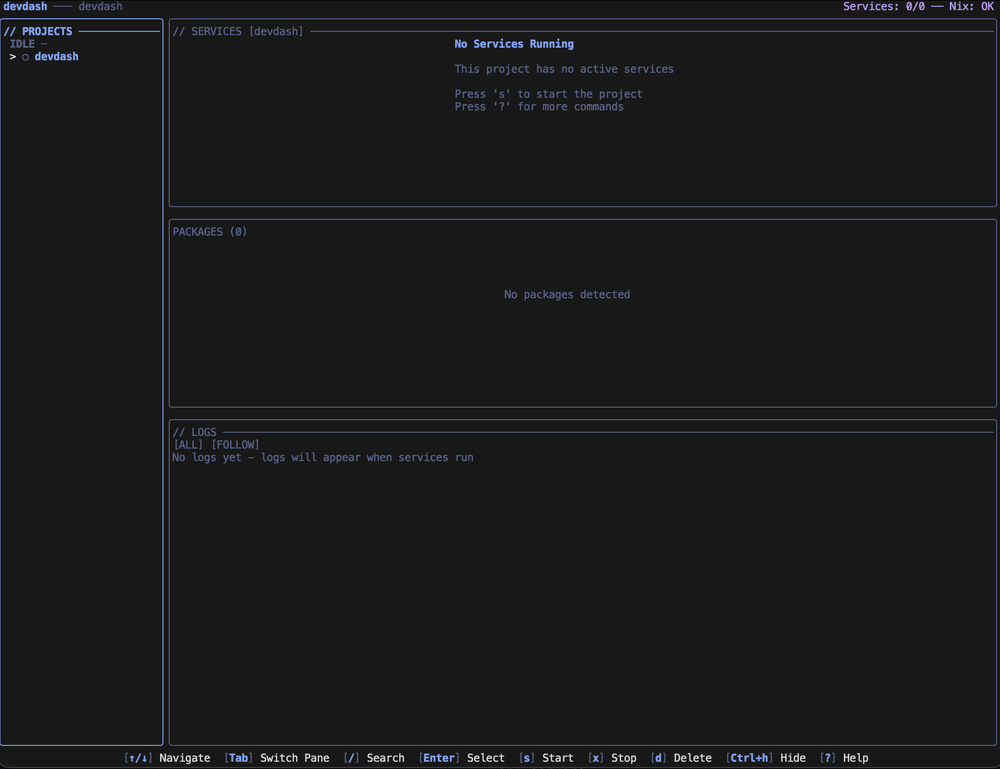

<div align="center">

# devdash

**Terminal Dashboard for devenv.sh Projects**

[](https://nixos.org)
[](https://devenv.sh)
[](https://go.dev)
[](https://github.com/infktd/devdash/actions)
[](LICENSE)

[Installation](#installation) • [Quick Start](#quick-start) • [Features](#features) • [Configuration](#configuration)

</div>

---

## What is devdash?

**devdash** is a terminal UI for managing multiple [devenv.sh](https://devenv.sh) projects from one place. Instead of running `devenv up` in separate terminals and manually checking logs, devdash gives you a unified dashboard to monitor and control all your development environments.

```
┌─ Projects ────────────────┐┌─ Services (my-api) ─────────────────────────┐
│ > my-api         [Running]││  postgres    Running  ↑ 2h 15m  CPU: 2%    │
│   blog-site      [Idle]   ││  redis       Running  ↑ 2h 15m  CPU: 1%    │
│   data-pipeline  [Stopped]││  api-server  Running  ↑ 2h 14m  CPU: 15%   │
└───────────────────────────┘│  worker      Stopped  ↓ 5m ago             │
                             └──────────────────────────────────────────────┘
┌─ Logs (api-server) ──────────────────────────────────────────────────────┐
│ 2026-01-21 21:30:45 INFO  Server starting on port 8080                   │
│ 2026-01-21 21:30:46 INFO  Connected to database                          │
│ 2026-01-21 21:31:02 DEBUG Handling request GET /api/users               │
└──────────────────────────────────────────────────────────────────────────┘
```



## Why?

When working with multiple devenv projects, you end up with:
- Multiple terminals running `devenv up`
- Switching between tabs to check logs
- No visibility when services crash
- Manual navigation between project directories

devdash solves this by providing a single interface for all your projects.

---

## Installation

### Nix Flakes (Recommended)

```bash
# Run directly
nix run github:infktd/devdash

# Install to profile
nix profile install github:infktd/devdash

# Add to flake.nix
{
  inputs.devdash.url = "github:infktd/devdash";
  # ...
}
```

### Go Install

```bash
go install github.com/infktd/devdash@latest
```

### Build from Source

```bash
git clone https://github.com/infktd/devdash
cd devdash
nix build    # or: go build
./result/bin/devdash
```

**Requirements:**
- [devenv.sh](https://devenv.sh) installed
- process-compose (included with devenv)
- Linux or macOS

---

## Quick Start

### 1. Launch devdash

```bash
devdash
```

On first run, devdash creates a config at `~/.config/devdash/config.yaml` and scans `~/code` and `~/projects` for devenv projects.

### 2. Configure Scan Paths

Edit `~/.config/devdash/config.yaml` to tell devdash where your projects are:

```yaml
projects:
  scan_paths:
    - ~/code
    - ~/work
    - ~/personal/projects
  scan_depth: 3
  auto_discover: true
```

### 3. Use It

| Key | Action |
|-----|--------|
| `↑`/`↓` or `j`/`k` | Navigate |
| `Enter` | Select project |
| `s` | Start service/project |
| `x` | Stop service/project |
| `r` | Restart service |
| `/` | Search logs |
| `f` | Toggle log follow mode |
| `S` | Settings |
| `?` | Help |
| `q` | Quit |

---

## Features

### Project Management

**Automatic Discovery** - Scans configured directories for `devenv.nix` files and maintains a registry of all your projects.

**Multi-Project Switching** - Jump between projects instantly. The sidebar shows all projects with their current state.

**Project States:**
- `Running` - process-compose daemon active
- `Idle` - No services running
- `Degraded` - Some services crashed
- `Stale` - Socket exists but daemon not responding
- `Missing` - Project directory no longer exists

### Service Control

**Start/Stop/Restart** - Control individual services or entire projects with single keystrokes.

**Real-Time Status** - See which services are running, uptime, CPU usage, and exit codes.

**Health Monitoring** - Automatically detects service crashes and tracks recovery.

### Log Viewing

**Live Streaming** - Watch logs from any service in real-time.

**Search & Filter** - Press `/` to search logs, `n`/`N` to jump between matches, `Ctrl+F` to show only matching lines.

**Follow Mode** - Auto-scroll to latest logs (toggle with `f`).

**Syntax Highlighting** - Automatic detection of log levels (INFO, WARN, ERROR, DEBUG).

### Nix Package Viewer

**Package Inspector** - View installed Nix packages in the current devenv environment (narrow terminal mode).

**Categorization** - Packages grouped by category with descriptions and versions.

### Notifications

**Desktop Alerts** - Get notified when services crash or recover (macOS/Linux).

**In-App Toasts** - Non-intrusive notifications within the TUI.

**Per-Service Control** - Configure which services send notifications in the settings.

### Themes

Choose from 8 color schemes (press `S` for settings):

| Theme | Description |
|-------|-------------|
| `matrix` | Classic green-on-black hacker aesthetic |
| `gruvbox` | Retro groove with warm colors |
| `dracula` | Dark purple with pink accents |
| `nord` | Arctic, bluish color palette |
| `tokyo-night` | Clean modern blue/purple theme |
| `ayu-dark` | Golden/orange accents on dark background |
| `solarized-dark` | Scientific muted palette |
| `monokai` | Classic editor theme with vibrant colors |

---

## Configuration

devdash reads configuration from `~/.config/devdash/config.yaml`:

```yaml
projects:
  scan_paths:
    - ~/code
    - ~/projects
  auto_discover: true
  scan_depth: 3

notifications:
  system_enabled: true       # Desktop notifications
  tui_alerts: true           # In-app toast messages
  critical_only: false
  overrides:                 # Per-service overrides
    - service: postgres
      system: false          # Disable desktop notifications for postgres

ui:
  theme: matrix              # matrix | gruvbox | dracula | nord | tokyo-night | ayu-dark | solarized-dark | monokai
  default_log_view: focused
  log_follow: true
  show_timestamps: true
  dim_timestamps: true
  sidebar_width: 25

polling:
  focused_project: 2         # Poll active project every 2 seconds
  background_project: 10     # Poll background projects every 10 seconds
```

---

## Keybindings

### Global

| Key | Action |
|-----|--------|
| `q` | Quit (leave projects running) |
| `Ctrl+X` | Shutdown all projects and quit |
| `S` | Open settings |
| `E` | Edit config file |
| `H` | View alert history |
| `?` | Show help |
| `R` | Refresh |
| `Tab` | Next pane |
| `Shift+Tab` | Previous pane |

### Navigation

| Key | Action |
|-----|--------|
| `↑`/`↓` or `k`/`j` | Move up/down |
| `←`/`→` or `h`/`l` | Move left/right |
| `Enter` | Select |
| `Esc` | Back/Cancel |

### Actions

| Key | Action |
|-----|--------|
| `s` | Start service or project |
| `x` | Stop service or project |
| `r` | Restart service |
| `/` | Search |

### Project Management

| Key | Action |
|-----|--------|
| `Ctrl+H` | Hide/show project |
| `d` | Delete project from registry |
| `e` | Rename project |
| `m` | Update project path (if moved) |
| `c` | Repair stale project |

### Logs

| Key | Action |
|-----|--------|
| `f` | Toggle follow mode |
| `w` | Toggle line wrap |
| `y` | Copy visible logs to clipboard |
| `g` | Jump to top |
| `G` | Jump to bottom |
| `/` | Search logs |
| `n` | Next search match |
| `N` | Previous search match |
| `Ctrl+F` | Filter (show only matches) |

---

## Architecture

devdash communicates with devenv projects through process-compose's Unix socket API:

```
┌─────────────┐
│   devdash   │
└──────┬──────┘
       │
       ├─ Scans for devenv.nix files
       ├─ Maintains project registry
       ├─ Connects to .devenv/run/pc.sock
       ├─ Queries process-compose API
       ├─ Streams logs
       └─ Monitors health
```

**Components:**

```
devdash/
├── internal/
│   ├── compose/        # process-compose API client
│   ├── config/         # Configuration management
│   ├── health/         # Service health monitoring
│   ├── notify/         # Desktop notifications
│   ├── packages/       # Nix package scanning
│   ├── registry/       # Project registry
│   ├── scanner/        # Project discovery
│   └── ui/             # Terminal UI (Bubble Tea)
└── main.go
```

---

## Testing

devdash has 317 tests covering 59.8% of the codebase:

```bash
# Run all tests
go test ./...

# Run with coverage
go test -coverprofile=coverage.out ./...
go tool cover -html=coverage.out

# Run specific package
go test ./internal/ui -v
```

---

## Contributing

Contributions welcome! Please:

1. Fork the repository
2. Create a feature branch
3. Add tests for new functionality
4. Ensure tests pass: `go test ./...`
5. Submit a pull request

**Found a bug?** [Open an issue](https://github.com/infktd/devdash/issues)

---

## License

MIT License - see [LICENSE](LICENSE) for details

---

## Acknowledgments

Built with:
- [Bubble Tea](https://github.com/charmbracelet/bubbletea) - TUI framework
- [Lip Gloss](https://github.com/charmbracelet/lipgloss) - Terminal styling
- [huh](https://github.com/charmbracelet/huh) - Interactive forms
- [devenv](https://devenv.sh) - Development environments
- [process-compose](https://github.com/F1bonacc1/process-compose) - Process orchestration

---

<div align="center">

**Made for developers managing multiple devenv projects**

[⭐ Star on GitHub](https://github.com/infktd/devdash) if you find this useful!

</div>
